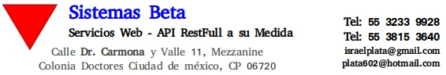

<!DOCTYPE html>
<html lang="en-AU" class="no-js">
<head>
<meta charset="UTF-8">
<meta name="Sistemas Beta" content="width=device-width">
<link rel="icon" href="images/favicon.svg" type="image/x-icon">
<link rel="profile" href="http://gmpg.org/xfn/11">
<link rel="pingback" href="https://keegan.st/xmlrpc.php">
<link rel='stylesheet' id='twentyfifteen-fonts-css'  href='https://fonts.googleapis.com/css?family=Noto+Sans%3A400italic%2C700italic%2C400%2C700%7CNoto+Serif%3A400italic%2C700italic%2C400%2C700%7CInconsolata%3A400%2C700&#038;subset=latin%2Clatin-ext' type='text/css' media='all' />
<link rel='stylesheet' id='genericons-css'  href='https://keegan.st/wp-content/themes/twentyfifteen/genericons/genericons.css?ver=3.2' type='text/css' media='all' />
<link rel='stylesheet' id='twentyfifteen-style-css'  href='https://keegan.st/wp-content/themes/twentyfifteen/style.css?ver=4.8.8' type='text/css' media='all' />
<meta name="generator" content="WordPress 4.8.8" />
</head>
<body class="index" onload="startTime()" id="page-top">

<header id="masthead" class="site-header" role="banner">
 

  <h1 class="site-title">
	 <a href="http://www.betapc.com/" rel="home">Sistemas Beta&#039;s</a>
  </h1>
  
Todos los Derechos Reservados

  

 
<!-- .site-branding -->
</header><!-- .site-header -->

	<aside id="text-1" class="widget widget_text">
	 <h2 class="widget-title">Portafolio de Servicios</h2>
	 

		<h2 href="https://github.com/ferbethasistemas/ServiciosWeb.git">Servicios Web</h2>
		<ul>
		 <li><a href="README.md#post-0001">Qué es un Servicio Web</a></li>
		 <li><a href="README.md#post-0002">Porque utilizar un Servicio Web</a></li>
		 <li><a href="README.md#post-0003">Diseño de su Propio API Rest Full</a></li>
		 <li><a href="README.md#post-0004">Esquemas de Desarrollo</a></li>
		 <li><a href="https://github.com/ferbethasistemas/CV" target="_blank">Currículum Vitae</a></li>
	  </ul>
	 

	</aside>
	<aside id="text-2" class="widget widget_text">
	 

		<h2 href="http://172.16.8.36/indice.html" target="_blank">Soporte Técnico</h2>
		<ul>
		 <li><a href="http://172.16.8.36/sicg.html">Reparación a Equipo de Cómputo</a></li>
		 <li><a href="http://172.16.8.36/sicg.html">Reparación a Impresoras</a></li>
		 <li><a href="http://172.16.8.36/sicg.html">Reparación a Equipos Celulares y Tablet's</a></li>
		 <li><a href="http://172.16.8.36/sicg.html">Servicio a Casa Habitación</a></li>
		 <li><a href="http://172.16.8.36/sicg.html">Servicio a Empresas u Organizaciónes</a></li>
		 <li><a href="http://172.16.8.36/sicg.html">Esquemas de Servicios </a></li>
		 <li><a href="http://172.16.8.36/sicg.html">Conclusiónes </a></li>
		 <li><a href="https://github.com/ferbethasistemas/CV">Currículum Vitae</a></li>
	  </ul>
	 

	</aside>
	<aside id="text-3" class="widget widget_text">
	 

		<h2 href="http://172.16.8.36/indice.html" target="_blank">Servicios Web</h2>
		<ul>
		 <li><a href="http://172.16.8.36/webservice.html" target="_blank">Qué es un Servicio Web</a></li>
		 <li><a href="http://172.16.8.36/webservice.html" target="_blank">Porque utilizar un Servicio Web</a></li>
		 <li><a href="http://172.16.8.36/webservice.html" target="_blank">Diseño de su Propio API Rest Full</a></li>
		 <li><a href="http://172.16.8.36/webservice.html" target="_blank">Esquemas de Desarrollo </a></li>
		 <li><a href="http://172.16.8.36/webservice.html" target="_blank">Conclusiónes </a></li>
		 <li><a href="https://github.com/ferbethasistemas/CV" target="_blank">Currículum Vitae</a></li>
	  </ul>
	 

	</aside>
	<aside id="text-4" class="widget widget_text">
	 

		<h2 href="http://172.16.8.36/indice.html" target="_blank">Front-End</h2>
		<ul>
		 <!-- Fuentes de los Proyectos: https://codepen.io/projects -->
		 <li><a href="http://172.16.8.36/frontend.html">Qué es el Fron-End</a></li>
		 <li><a href="http://172.16.8.36/frontend.html">Porqué Utilizar la Reactividad</a></li>
		 <li><a href="http://172.16.8.36/frontend.html">Consumo de API's</a></li>
		 <li><a href="http://172.16.8.36/frontend.html">Esquemas de Desarrollo </a></li>
		 <li><a href="http://172.16.8.36/frontend.html">Conclusiónes </a></li>
		 <li><a href="https://github.com/ferbethasistemas/CV">Currículum Vitae</a></li>
	  </ul>
	 

	</aside>

<!-- .widget-area -->

<!-- .secondary -->

<!-- .sidebar -->
<!-- ************************* Contenido de la Pagina **************************************    -->

<!-- Antes era: <main id="main" ... >  -->
<main  id="patterns" class="site-main" role="main">
	<article id="post-0001" class="post-00001 post type-post status-publish format-justify hentry category-uncategorised">
		<header class="entry-header">
		 
		 <h2 class="entry-title"><a href="http://172.16.9.36/indice.html" rel="bookmark">Qué es un Servicio Web</a></h2></header>
		

		<h4>Concepto</h4>
		
		
Un Servicio Web como lo define el WWW Consortium (W3C) es un Sistema de Sotware designado para dar soporte a la interacción de máquina a máquina interoperativa a través de una red.

		
El Servicio Web realiza una tarea específica o un conjunto de tareas, y se describe mediante una descripcioon de servicio en una notacion XML estandar llamada WSDL (Web Services Description Language).

		
La descripcion del Servicio proporciona todos los detalles necesarios para interactura con el Servicio, incluidos los formatos de mensaje (que detallan las operaciones), los protocolos de transporte y la ubicacion.

		<h3>Los Servicios Web los podemos clasificar en dos grandes grupos.</h3>
		<li>SOAP</li>
		<li>RestFull</li>
		<h3>Servicios SOAP</h3>
		
SOAP utiliza un formato de mensaje XML utilizando en interacciones de servicios web. Estos mensajes se envian sobre HTTP o JMS, pero se pueden utilizar otros protocolos de comunicacion.

		
SOAP es un tipo de Servicio Especifico descrito mediante la definicion de WSDL.

		
Hay que tener en cuenta que el Servicio SOAP solamente ofrece el protocolo de comunicacion XML.

		<h3>Servicios RestFull</h3>
		
Los Servicios RestFull, es un protocolo de comunicacion mas flexible que el SOAP, motivo por el cual la mayoria de las empresas optan por usarlo.

		
Al igual que el SOAP transporta datos mediante el protocolo HTTP ofreciendo metodos muy importantes y los mismos codigos de respuesta nativos del HTTP:

		<h3>Metodos</h3>
		<li>GET</li>
		<li>POST</li>
		<li>PUT</li>
		<li>DELETE</li>
		<h3>Codigos Nativos HTTP</h3>
		<li>404</li>
		<li>200</li>
		<li>204</li>
		<li>409</li>
		<h3>El termino REST</h3>
		
Significa que es tan flexible que permite transmitir casi cualquier informacion o datos (XML, JSON, Binario, etc.) siendo el JSON el preferido por la mayoria de los Servicios Web RestFull puesto que es interpretado por javaScript de forma nativa.

		<h2 id="post-0002">Porque Utilizar un Servicio Web</h2>
		
Hoy en dia, existe una gran exigencia en los sistemas con apoyo de las nuevas tecnologias con el que estan construidos los sistemas informaticos de las empresas.

		
En su mayoria, se encuentran alojados en Servidores Web y esta informacion es consumida via Web.

		
Por lo que una de las mejores alternativas es utilizar los Servicios Web RestFull. Estos Servicios Web RestFull son aquellos que se comunicaran con sus Sistemas Informaticos.

		

		<h2 id="post-0003">Diseñamos su API Rest Full a su Medida</h2>
		
Tenemos las Herramientas en Tecnologia para deseñar su propio API RestFull exactamente a su medida de su Negocio o Empresa.

		
		<h2 id="post-0004">Esquemas de Desarrollo</h2>
		
Ofrecemos el Desarrollo de su API Rest Full por cada Modulo de su Empresa o Negocio.

		
Para que le quede mas claro, si su negocio cuenta con un catalogo de productos, y esos productos estan sujetos a disposicion, una alternativa para sus clientes es que cuando consulten su pagina web, sepan exactamente las existencias de cada producto que usted ofrece.

		
El API, respondera a esas preguntas y el cliente no tendra la necesidad de llamarle por telefono o preguntar via correo la existencia de dicho producto, puesto que lo que muestra el API es informacion fresca y directa del corazon de su Base de Datos o Sistemas que usted utiliza dia a dia dentro de su Organizacion.

		
		
Para más de 3 módulos o tablas relacionadas y no más de 5 tablas relacionadas

		
		<!-- .entry-content -->
		<footer class="entry-footer">
			Colocado en:
			<time class="entry-date published updated" datetime="2019-04-01T21:44:01+00:00">Abril 01, 2019</time></a>
		  
		</footer><!-- .entry-footer -->
	</article><!-- #post-## -->
</main><!-- .site-main -->

<!-- .content-area -->

<!-- .site-content -->
<footer id="colophon" class="site-footer" role="contentinfo">
	

	<a href="https://wordpress.org/">Desarrollado por Sistemas BETA</a>
  
<!-- .site-info -->
</footer><!-- .site-footer -->

<!-- .site -->
</body>
</html>
